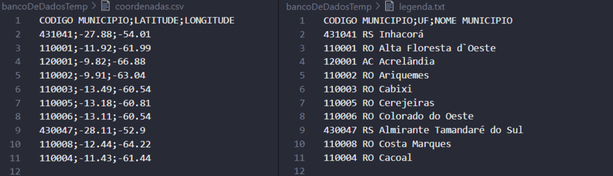
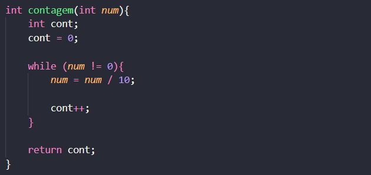

## :family_man_woman_girl_boy: Equipe
:man_teacher: Professor: [Kennedy Reurison Lopes](https://github.com/kennedyufersa). 
:man_student: Integrante: [Arthur Kellyson Pinheiro de Negreiros](https://github.com/Arthurkellysonp).  
:woman_student: Integrante: [Geísa Morais Gabriel](https://github.com/Geisa-mg). 
:man_student: Integrante: [Leonardo Inácio Guilherme Dantas](https://github.com/LeonardoIGD). 
:woman_student: Integrante: [Livia Beatriz Maia de Lima](https://github.com/liviabeatrizml). 
:man_student: Integrante: [Pedro Makson Fontes da Costa](https://github.com/PedroMakson).

## Hash Table (Tabela de Dispersão)
> Uma Tabela de Dispersão ou Hash é uma estrutura de dados, semelhante a vetor de elementos, que associa seus dados a chaves específicas para facilitar na sua busca. Por meio dessa tabela também torna-se possível inserir e remover os elementos nela contidos. A utilização da estrutura hash tem como propósito fundamental realizar busca de dados de maneira constante (complexidade O(1)), mas isso nem sempre é possível, pois no momento de inserção de diversos elementos na tabela há grandes chances de haver colisões, o que altera a complexidade para O(n), semelhante a de uma lista.   

Baseado no estudo da Tabela de Dispersão, bem como em sua utilização em linguagem C++, implementou-se uma pasta contendo os arquivos necessários para buscar, inserir e remover cidades brasileiras baseadas nas localidades. Nesse sentido, a fim de tratar as possíveis colisões previstas, visto a gama de municípios, fez-se o uso do endereçamento aberto através da sondagem linear. Dessa forma, o espaço fica alocado de uma forma eficiente. No entanto, a sondagem linear, uma vez que procura adicionar um elemento na primeira posição livre seguinte, também prejudica o desempenho da busca quando se elimina um determinado elemento, mas esse problema pode ser resolvido. 

 -  Alteração no código pré-determinado pelo professor
	-   Arquivos não alterados
	    -   bancoDeDados - Mantemos as mesmas informações das cidades;
	    -   cidade.cpp - Não alteramos nada nesse arquivo para mantermos a mesma estrutura dada pelo professor.
	-   Arquivos alterados
		-   bancoDeDadosTemp - Organizamos um banco de dados menor contendo apenas informações de algumas cidades para facilitar os testes;
		-   lerArquivos.cpp - Alterações a forma que os dados do banco de dados são apresentados com o printf no terminal;
		-   Hash.cpp - Criamos novas funções para a aplicação um novo método de inserção de elementos na tabela e tratamento de colisões;
		-   main.cpp - Modificamos o arquivo para adicionar todas as cidades na tabela Hash.

## :computer: Desenvolvimento e explicação dos códigos: 
#### bancoDeDadosTemp    
> Para facilitar o teste das funções do nosso código, organizamos em outra pasta um banco de dados temporário para teste, no intuito de diminuir o número de dados para a análise.

-   Ao invés de utilizarmos o banco de dados disponibilizado pelo professor que contém cerca de 5570 cidades para fazermos os testes das aplicações, criamos um segundo banco de dados contendo apenas 10 cidades escolhidas a dedo.  
-   As cidades escolhidas para fazermos os testes, se encaixam em todas as situações que o nosso código promete resolver, seja inserir, remover ou buscar cidades na tabela HASH, ou até mesmo tratar colisões no momento de inserção de elementos.

#### lerArquivos.cpp    
> Mantemos basicamente as mesmas coisas presentes no código original vindo do professor, somente alteramos as funções de apresentação de dados.

##### printDataItens(dataItem *dados)
-   Para a exposição dos dados e apresentação mais coerente e visível das informações, foi feito a função printDataItens que irá dispor das informações “Identificador, Estado, Cidade, Latitude e Longitude” no terminal de maneira apresentável e identificável, na qual é passado como parâmetros os dados do arquivo .txt

##### saveDataItens(dataItem *dados)
- A função saveDataItens irá salvar as informações organizadas em um arquivo .txt, como uma forma de um arquivo auxiliar. Foi pelo foden(“dados.dat”, “w”) que os dados foram escritos e direcionados.

#### Hash.cpp    
- No arquivo Hash.cpp criamos funções necessária para a implementação de um novo método de inserção de elementos na Tabela Hash, a DOBRA, e também atualizamos todas as funções para se adequar a forma de tratamento de colisão de maneira aberta, a SONDAGEM LINEAR.

##### contagem(int num)
- Função que realiza a contagem dos valores a serem manipulados na função dobra. Enquanto o num (correspondente à key) for diferente de zero haverá a divisão por dez, com o incremento da variável cont, responsável por fazer a contagem dos elementos.

>Ou seja, para o exemplo do número relativo a key “431041” será realizado a divisão inteira sucessiva por dez (431041/10; 43104/10, 4310/10; …) até o final da contagem dos algarismos.
