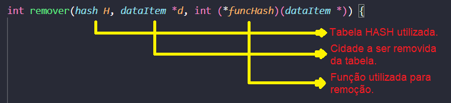

## :family_man_woman_girl_boy: Equipe
:man_teacher: Professor: [Kennedy Reurison Lopes](https://github.com/kennedyufersa). 
:man_student: Integrante: [Arthur Kellyson Pinheiro de Negreiros](https://github.com/Arthurkellysonp).  
:woman_student: Integrante: [Geísa Morais Gabriel](https://github.com/Geisa-mg). 
:man_student: Integrante: [Leonardo Inácio Guilherme Dantas](https://github.com/LeonardoIGD). 
:woman_student: Integrante: [Livia Beatriz Maia de Lima](https://github.com/liviabeatrizml). 
:man_student: Integrante: [Pedro Makson Fontes da Costa](https://github.com/PedroMakson).

## Hash Table (Tabela de Dispersão)
> Uma Tabela de Dispersão ou Hash é uma estrutura de dados, semelhante a um vetor de elementos, que associa seus dados a chaves específicas para facilitar na sua busca. Por meio dessa tabela também torna-se possível inserir e remover os elementos nela contidos. A utilização da estrutura hash tem como propósito fundamental realizar a busca de dados de maneira constante (complexidade O(1)), mas isso nem sempre é possível, pois no momento de inserção de diversos elementos na tabela há grandes chances de haver colisões, o que altera a complexidade para O(n), semelhante a de uma lista.   

Baseado no estudo da Tabela de Dispersão, bem como em sua utilização em linguagem C++, implementou-se uma pasta contendo os arquivos necessários para buscar, inserir e remover cidades brasileiras baseadas nas localidades. Nesse sentido, a fim de tratar as possíveis colisões previstas, visto a gama de municípios, fez-se o uso do endereçamento aberto através da sondagem linear. Dessa forma, a alocação do espaço ocorre de forma eficiente. No entanto, a sondagem linear, uma vez que procura adicionar um elemento na primeira posição livre seguinte, também prejudica o desempenho da busca quando se elimina um determinado elemento, mas esse problema pode ser resolvido. 

 -  Quanto à alteração no código pré-determinado pelo professor:
	-   Arquivos não alterados
	    -   bancoDeDados - Mantemos as mesmas informações das cidades;
	    -   cidade.cpp - Não alteramos nada nesse arquivo para mantermos a mesma estrutura dada pelo professor.
	-   Arquivos alterados
		-   bancoDeDadosTemp - Organizamos um banco de dados menor contendo apenas informações de algumas cidades para facilitar os testes;
		-   lerArquivos.cpp - Alterações a forma que os dados do banco de dados são apresentados com o **printf** no terminal;
		-   Hash.cpp - Criamos novas funções para a aplicação um novo método de inserção de elementos na tabela e tratamento de colisões;
		-   main.cpp - Modificamos o arquivo para adicionar todas as cidades na tabela Hash.

## :computer: Desenvolvimento e explicação dos códigos: 
#### [:open_file_folder:] bancoDeDadosTemp    
> Para facilitar o teste das funções do nosso código, organizamos em outra pasta um banco de dados temporário para teste, no intuito de diminuir o número de dados para a análise.

-   Ao invés de utilizarmos o banco de dados disponibilizado pelo professor que contém cerca de 5570 cidades, para fazermos os testes das aplicações criamos um segundo banco de dados contendo apenas 10 cidades escolhidas a dedo.  
-   As cidades escolhidas para fazermos os testes se encaixam em todas as situações que o nosso código promete resolver, seja inserir, remover ou buscar cidades na tabela HASH, ou até mesmo tratar colisões no momento de inserção de elementos.

##
#### [:card_index_dividers:] lerArquivos.cpp   
> A grosso modo, mantemos o código original disponibilizado pelo professor, somente alteramos as funções de apresentação de dados.

##
##### [:clipboard:] printDataItens(dataItem *dados)
-   Para a exposição dos dados e apresentação mais coerente e visível das informações, foi feito a função printDataItens que irá dispor das informações “Identificador, Estado, Cidade, Latitude e Longitude” no terminal de maneira apresentável e identificável, na qual é passado como parâmetros os dados do arquivo .txt

##
##### [:clipboard:] saveDataItens(dataItem *dados)
- A função saveDataItens irá salvar as informações organizadas em um arquivo .txt, como uma forma de um arquivo auxiliar. Foi pelo foden(“dados.dat”, “w”) que os dados foram escritos e direcionados.

##
#### [:bookmark_tabs:] Hash.cpp
- No arquivo Hash.cpp criamos funções necessária para a implementação de um novo método de inserção de elementos na Tabela Hash, a DOBRA, e também atualizamos todas as funções para se adequar a forma de tratamento de colisão de maneira aberta, a SONDAGEM LINEAR.

##
##### [:free:] porcentTable(hash &H)
-  Função que realiza o cálculo de ocupação da tabela, mostrando a porcentagem e a quantidade de posições ocupadas por cidades na tabela Hash. O cálculo é feito com base em um contador que verifica cada posição da tabela e ver se ela está ocupada ou não, no final é apresentado esse dado.

##
##### [:1234:] contagem(int num)
- Função que realiza a contagem dos valores a serem manipulados na função dobra. Enquanto o **num** (correspondente à **key**) for diferente de zero haverá a divisão por dez, com o incremento da variável **cont**, responsável por fazer a contagem dos elementos.

>Ou seja, para o exemplo do número relativo a key “431041” será realizado a divisão inteira sucessiva por dez (431041/10; 43104/10, 4310/10; …) até o final da contagem dos algarismos.

##
##### [:arrows_counterclockwise:] inverte(int num)
- Função que realiza a inversão de valores necessários para a dobra. Enquanto o número (num) que se deseja inverter for maior que zero, a variável invt realiza o resultado da operação de cada algarismo a ser invertido.

##
##### [:heavy_plus_sign:] somaR(int num1, int num2)
- Função que soma os elementos da dobra de acordo com as restrições da função, ou seja, para resultados de soma com duas casas decimais o número contido na casa das dezenas é ignorado na próxima soma.

##
##### [:curly_loop:] dobra(dataItem *d)
- Realiza a inserção do elemento na hash utilizando o método de dobra, ou seja, a alocação da cidade na tabela ocorre a partir do código (key) do município que se deseja inserir.
- Na inserção de cada elemento ocorre a entrada na função **dobra**, esse método recebe como parâmetro um ponteiro **(*d)** que aponta para o **typedef** **dataItem**  referente à tabela **hash**.

 
 
- Logo após, a variável **key** recebe o código relativo a primeira cidade que deve ser inserida, de acordo com o que está sendo expresso no arquivo contido dentro da pasta **bancoDeDados**.

Depois disso, a variável **totalAlgarismos** chama a função que realiza a contagem dos elementos da **key**. Posteriormente, será atribuído o valor de **cont** a variável **totalAlgarismos**.

- Em seguida é feita a divisão da quantidade de algarismos por 2. A variável process recebe o resultado da divisão. A variável **aux** armazena os dois primeiros elementos da **key**. Após isso, acontece a troca dos elementos através da chamada função **inverte**.

- Para que se efetive todo o desenvolvimento da dobra, o while identifica enquanto o processo for diferente de 1. Dessa forma, será atribuída à key a remoção dos elementos da dobra até que seja efetuado toda a execução da soma.
- Para isso, a variável **num1** armazena o primeiro par com algarismos invertidos a serem somados com a variável **num2**, que arquiva o par seguinte. Logo após será realizado a soma dos valores armazenados através da função **somaR**, até ser retornado o valor de **num1**, a operação será realizada sucessivas vezes até o final da dobra. Por fim, a **key** armazena a posição da tabela resultado da soma.

##
##### [:robot:] createDummy()
- No momento de removermos uma cidade da tabela Hash que é fruto de uma colisão pode ocorrer de quando a removermos perdemos a localização de uma próxima cidade, cidade essa que é fruto da mesma colisão e está localizada após (SONDAGEM LINEAR) a outra removida.

-   Por isso, ao invés de limparmos totalmente aquele ponto, colocamos uma cidade fictícia/sem importância dentro dela, mas isso não impede que outra cidade seja inserida nessa posição.

##
##### [:heavy_check_mark:] inserir(hash H, dataItem *d, int (*funcHash)(dataItem *))
- A função inserir irá receber 3 parâmetros:

	- A tabela Hash, onde iremos adicionar as cidades;
	- Os dados das cidades, que são fruto do nosso banco de dados;
	- A função que será utilizada para conseguir a key e inseri-la na tabela Hash.
		- Divisão;
		- Multiplicação;
		- Dobra.

- Inicialmente definimos algumas variáveis que iremos utilizar como **unisigned int**, unisigned porque não iremos trabalhar com valores negativos para índices da tabela Hash.

-   Determinamos que a variável **key** irá receber o resultado da função utilizada para inserção (divisão, multiplicação ou dobra).
-   Após isso, pegamos as informações da cidade que iremos utilizar.

-   Para pegar essas informações, é necessário alocarmos primeiramente um espaço na memória.
- Pode acontecer de que o valor final da **key** (funcHash) seja maior que o tamanho da tabela Hash, o que impossibilita adicioná-lo na tabela, já que é inserido com base no índice.
- 

-   Para resolver isso, atribuímos ao **key** restante da divisão de **key** pelo tamanho da tabela caso o valor de **key** inicialmente seja maior que a tabela.
-   Agora iniciamos o processo de inserir as cidades na tabela Hash.

-   De primeira instância verificamos se a posição da tabela em questão (**key**) está vazia, caso esteja, é só adicionar a cidade nela. E encerramos a função.
- Mas, podem ocorrer colisões no momento de inserção de cidades na tabela, ou seja, no momento de adicionar uma cidade na tabela, a posição (**key**) em questão já está ocupada por outra, então é necessário tratar essa colisão.

- Estamos utilizando o método de SONDAGEM SEQUENCIAL para tratar as nossas colisões, onde a cada tentativa de inserção numa cidade mal sucedida, a chave é incrementada em +1 a chave atual. Esse processo continua até achar uma posição **vazia** ou com **key = -1**, devido a nossa função **createDummy()**.

- Por fim, caso nenhuma das etapas anteriores não sejam executadas, é retornado um “erro” (return -1).

##
##### [:x:] remover(hash H, dataItem *d, int (*funcHash)(dataItem *))
- A função remover irá receber 3 parâmetros:

	- A tabela Hash, onde iremos remover a cidade; 
	-  Os dados das cidades, que são fruto do nosso banco de dados;
    - A função que será utilizada para conseguir a key e removê-la da tabela Hash:
	    - Divisão;
	    - Multiplicação; 
	    - Dobra.

- Antes de tudo definimos algumas variáveis que iremos utilizar como **int**.

-   Determinamos que a variável **key** irá receber o resultado da função utilizada para inserção (divisão, multiplicação ou dobra).
- Primeiramente verificamos se a posição em questão está vazia, pois se ela estiver, não haverá nada o que remover. Assim, continuamos procurando o elemento com a mesma **key** daquela que iremos remover até achar um elemento da tabela vazia.

- Caso encontremos a cidade que queremos remover, substituímos ela por uma dataItem dummy (neutro), pois não podemos esvaziar totalmente o ponto em que a cidade está localizado devido a possível existência de uma cidade sucessora proveniente da mesma colisão, o que impossibilita a busca da cidade.

- Caso nenhum dos processos acima seja executado, ou seja, o elemento não seja encontrado, é retornado um “erro” **(return -1)**.

##
##### [:mag:] buscar(hash H, int key, int (*funcHash)(dataItem *))
- A função buscar irá receber 3 parâmetros:

	- A tabela Hash, onde iremos remover a cidade;
	- O ID/Key da cidade a ser buscada na tabela Hash;
	- A função que será utilizada para conseguir a key para comparar com o ID da cidade buscada:
		- Divisão;
		- Multiplicação;
		- Dobra.

- Já que passamos somente o ID da cidade que queremos buscar na nossa tabela HASH, criamos uma dataItem (semelhante a uma cidade mesmo).

- No dataItem criado, definimos que o seu campo key irá receber o valor do ID passado como parâmetro, pois precisamos saber onde essa cidade poderia estar localizado na tabela.
-   Para podermos localizar onde essa cidade estará na nossa tabela, utilizamos a função passada como parâmetro.

- Com isso, obtemos uma chave que será utilizada com índice da tabela e possivelmente localizá-la depois.

-   Com um **while** fazemos a busca na tabela Hash até encontrarmos um item vazio, pois se chegou até ali significa que algo está errado e encerra a procura. No entanto, caso a cidade seja encontrada, o dataItem que criamos anteriormente irá receber a cidade da tabela Hash no momento e retorna-la, provando que a cidade está sim na tabela Hash.   
-   Há cada comparação, é feito um incremento no índice da tabela para que a comparação não seja feita com apenas uma cidade, e sim de forma sequencial.
-   Por fim, caso nada dê certo, é retornado um “erro” (return -1), que significa que o elemento não está na tabela.

####
##### main.cpp
> Utilizamos esse arquivo como uma interface do nosso código.

Uma de nossas preocupações foi manter o código organizado, compreensível e indentando de maneira correta. Para isso, separamos as informações, dividimos o código em diferentes arquivos e comentamos as linhas de código para poder se localizar. Sempre com o intuito de torná-lo o mais interpretativo possível.
Dessa maneira, realizou-se a divisão das partes do desenvolvimento do código para que todos participassem, e ao final foi alcançado o resultado do código por completo.
